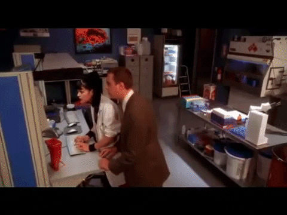

## Hey 👋, I'm [Deepak!](https://github.com/Deepak=0801/)

I'm currently pursuing my graduation in Computer Science 🎓 from SRM Institute of Science & Technology 🏛. I have a keen interest in exploring the various aspects of computer science, including programming languages, algorithms, data structures, and software development. 💡. I love to explore new technologies and leverage them to solve real-life problems ✨. I am a newbie to Github, currently building it from scratch 👨🏻‍💻.

Joined Github **1** year ago.

### About Me:

- 🛠 &nbsp; I’m currently working with Python,Matlab and R.
- 🚀 &nbsp; I’m learning Data Analysis with R.
- 👾 &nbsp; Fun fact: The first hard drive was 5 MB in size.
- 📫 &nbsp; How to reach me: dk7483@srmist.edu.in (or) dksiva812@gmail.com.

### My Absolute Favorites:

- :robot: &nbsp; I love AI.
- :sleeping: &nbsp; Sleeping.
- 🍕 &nbsp; Food, Hackathons and Seminars.

### Languages and Tools:

<code></code>
<code></code>
<code></code>
<code></code>
<code></code>
<code></code>
<code></code>
<code></code>
<code></code>
<code></code>
<code></code>

<!--
<code></code>
-->

### Projects and Dev Stuffs:

	
  
<b>⚡ Github Stats</b>

   
  
  

	
  
<b>☄️ Github Streaks</b>

   
  

  
<b>⚙️ Things I use to get stuff done</b>

  	<ul>
  	    <li><b>OS:</b> Windows 10</li>
	    <li><b>Laptop: </b> Custom PC (i5-10400F)</li>
  	    <li><b>Browser: </b> Opera GX</li>
	    <li><b>Code Editor:</b> VSCode(duh)</li>
	    <li><b>To Stay Updated:</b>9gag</li>
	     
	</ul>	

#

